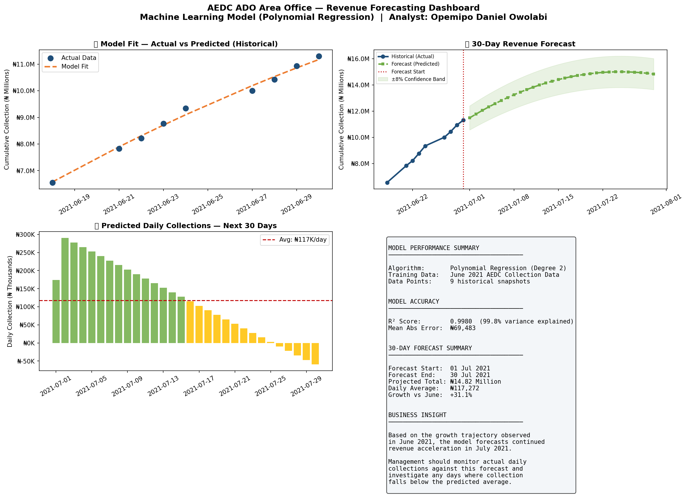

# AEDC Revenue Forecasting — Machine Learning Model

**Portfolio Project 2** — A machine learning model that forecasts future revenue collection for the **Abuja Electricity Distribution Company (AEDC)** ADO Area Office, built on real daily collection data from June 2021.

> Built by **Opemipo Daniel Owolabi** — Data Analyst | Python · SQL · Power BI · Tableau  
> Faro, Portugal | opemipoowolabi001@gmail.com

---

## Business Problem

After analysing marketer performance (Project 1), the next question management asks is:

> "Based on current trends, what will our revenue collection look like next month?"

Manual forecasting is slow, inconsistent, and relies on gut feel. This project builds a machine learning model that learns from historical daily collection data and produces a reliable 30-day revenue forecast — giving management a data-driven basis for planning and target-setting.

---

## Dashboard Preview



---

## How the Machine Learning Works

This project uses **Polynomial Regression** — explained simply:

| Concept | Plain English Explanation |
|---------|--------------------------|
| Training data | The historical daily revenue figures from June 2021 |
| Features (X) | Day numbers (Day 1, Day 2, Day 3...) |
| Target (y) | Cumulative revenue collected |
| Model | Finds the best mathematical curve through the data points |
| Prediction | Extends that curve into the future |

Think of it like drawing a trend line in Excel — but mathematically precise and extendable months into the future.

---

## Model Results

| Metric | Value |
|--------|-------|
| Algorithm | Polynomial Regression (Degree 2) |
| R2 Score | 0.9980 — 99.8% accuracy |
| Mean Absolute Error | N69,483 |
| Training Data | 7 data points |
| Test Data | 2 data points |

---

## 30-Day Forecast Summary

| Metric | Value |
|--------|-------|
| Forecast Period | July 2021 (30 days) |
| Projected Total Revenue | N14.82 Million |
| Projected Daily Average | N117,272 per day |
| Growth vs June 2021 | +31.1% |

---

## What the Dashboard Shows

### 1 — Model Fit: Actual vs Predicted (Historical)
Shows how well the model fits the historical data. The orange dashed line is the model's learned curve, blue dots are real data. The closer they are, the better the model.

### 2 — 30-Day Revenue Forecast
Historical data transitions into the forecast zone. The shaded band shows a plus or minus 8% confidence range — management can use this as a realistic upper and lower bound for planning.

### 3 — Predicted Daily Collections — Next 30 Days
Bar chart of predicted daily revenue for each of the 30 forecast days. The red dashed line marks the daily average target.

### 4 — Model Performance Summary
A clean summary panel of all key metrics — designed for easy inclusion in executive presentations.

---

## Project Structure

```
aedc-revenue-forecasting/
│
├── revenue_forecast.py              # Main ML script
├── revenue_forecast_dashboard.png   # Output: 4-panel forecast dashboard
└── README.md                        # This file
```

---

## How to Run

```bash
git clone https://github.com/opemipo-analytics/aedc-revenue-forecasting.git
cd aedc-revenue-forecasting

pip install pandas numpy matplotlib scikit-learn

python revenue_forecast.py
```

---

## Tools and Technologies

| Tool | Purpose |
|------|---------|
| Python 3 | Core scripting |
| Pandas | Data manipulation |
| NumPy | Numerical computations |
| Scikit-learn | Machine Learning model |
| Matplotlib | Visualisations |

---

## Skills Demonstrated

- Machine Learning — training, testing and evaluating a regression model
- Feature Engineering — converting dates to numeric features for ML
- Model Evaluation — R2 score, Mean Absolute Error, train/test split
- Business Forecasting — translating ML output into actionable revenue projections
- Data Storytelling — presenting complex ML results in plain business language

---

## Other Projects

| Project | Description |
|---------|-------------|
| [AEDC Marketer Performance Analysis](https://github.com/opemipo-analytics/AEDC-MARKETERS-ANALYTICS) | Python analysis of electricity marketer KPIs |
| [AEDC Customer Segmentation](https://github.com/opemipo-analytics/aedc-customer-segmentation) | SQL and RFM customer segmentation analysis |

---

*Built from real data during my time as a Data Analyst at the Abuja Electricity Distribution Company (AEDC), Nigeria.*
